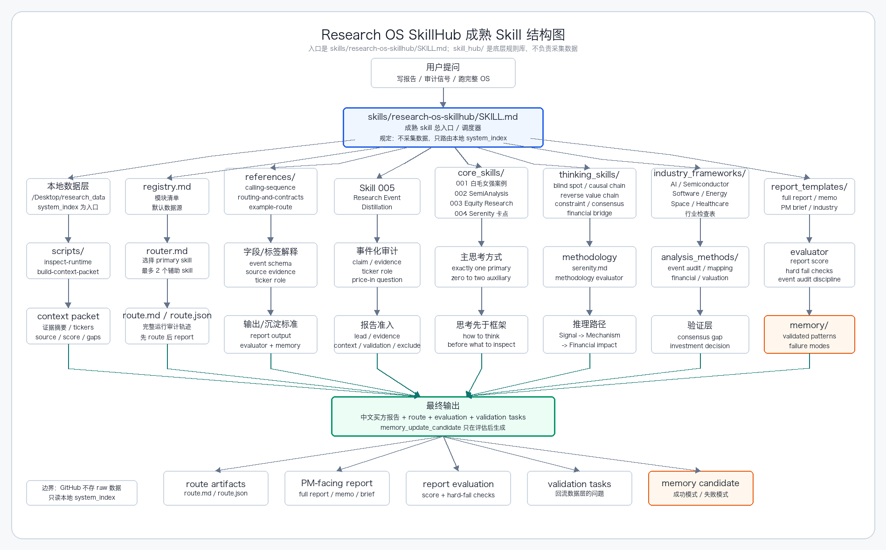

# Architecture

The Buy-side Research OS has two major layers:



```text
runtime data layer
-> GitHub SkillHub / report operating layer
```

## Runtime Data Layer

The runtime data layer lives outside GitHub:

```text
/Users/pangpatrick/Desktop/research_data/
```

It stores:

- `raw_data/`: daily raw archive
- `readable/`: human-readable PDFs
- `system_index/`: machine-readable JSON and indexes

Machine workflows should start from:

```text
/Users/pangpatrick/Desktop/research_data/system_index/index.jsonl
```

## GitHub SkillHub Layer

This repository stores:

- mature skill entry packages under `skills/`
- underlying SkillHub rules under `skill_hub/`
- data-layer contract under `data_layer/`
- small wrapper scripts under `scripts/`
- documentation under `docs/`

## Main Skill Package

The main mature skill package is:

```text
skills/research-os-skillhub/
├── SKILL.md
├── agents/openai.yaml
├── references/
└── scripts/
```

This mirrors mature public skills:

- `SKILL.md`: entry point and execution rules
- `references/`: schema, taxonomy, report standard, memory rules
- `scripts/`: repeatable local validation and context-packet helpers
- `agents/openai.yaml`: UI / invocation metadata

## Underlying Rule Library

The underlying reusable rule library is:

```text
skill_hub/
├── registry.md
├── router.md
├── contracts/
├── references/
├── core_skills/
├── thinking_skills/
├── research_methodologies/
├── industry_frameworks/
├── analysis_methods/
├── report_templates/
├── evaluators/
├── examples/
└── memory/
```

`skills/research-os-skillhub/SKILL.md` is the front door. `skill_hub/` is the library it calls.

## Standard Flow

```text
local system_index
-> context packet
-> SkillHub route
-> selected references
-> primary core skill
-> auxiliary core skills
-> thinking skills / methodology
-> industry frameworks
-> analysis methods
-> report template
-> report
-> evaluation
-> validation tasks
-> memory candidate
```
